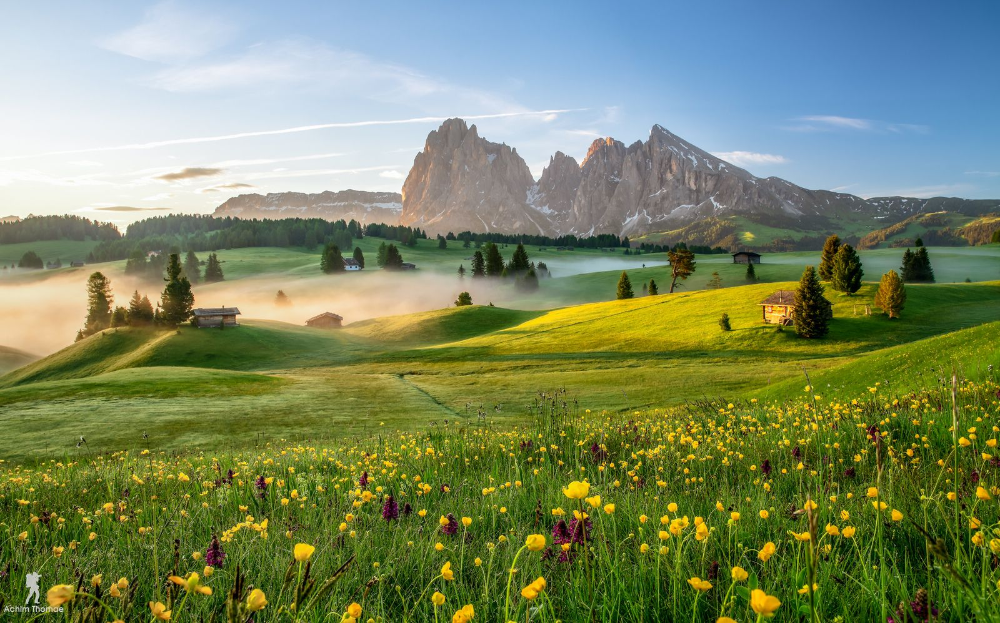

Александр, 24 года.

Учусь на втором курсе магистратуры. 
Пишу диссертацию на тему "Электропривод рулевых поверхностей летательного аппарата".

Учусь программировать микроконтроллеры, изучаю язык С++.

